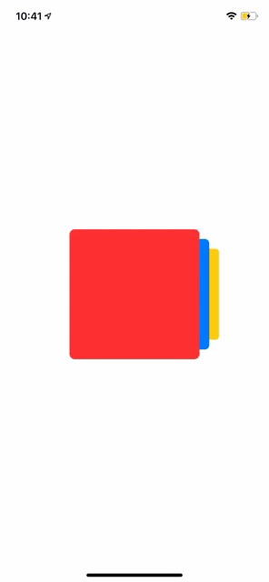

# CardStack


[](https://swift.org/package-manager)

[](https://github.com/nhoogendoorn/CardStack/releases)
[](https://github.com/nhoogendoorn/CardStack/blob/master/LICENSE)

> A SwiftUI package that lets you implement swipable cards in your project.
 


## Requirements

- iOS 13.0+
- Xcode 11.0

# Installation

The preferred way of installing CardStack is via the [Swift Package Manager](https://swift.org/package-manager/).

1. In Xcode, open your project and navigate to **File** → **Swift Packages** → **Add Package Dependency...**
2. Paste the repository URL (`https://github.com/nhoogendoorn/CardStack`) and click **Next**.
3. For **Rules**, select **Version** (with `Up to Next Major`).
4. Click **Finish**.

## Usage example

> For a full example see the example project.

Initialize a CardStack view by passing a CardView and CardData. CardView is a protocol that inherits from View and CardData is a protocol that inherits from Identifiable.

### CardData

The CardData object just needs to have an id, but can for the rest contain any type of data.

```swift
import SwiftUI
import CardStack

struct DataExample: CardData {
    var id: String
    var color: Color
}
```

### CardView

The Card View will have access to the data you define as CardData.

```swift
import SwiftUI
import CardStack

struct CardExampleView: Card {
    var data: DataExample?
    
    init<CardData>(data: CardData) where CardData: CardData {
        if let infoData = data as? DataExample {
            self.data = infoData
        }
    }
    
    var body: some View {
        data?.color
            .frame(width: 200, height: 200)
            .shadow(color: Color.black.opacity(0.1), radius: 3, x: 0, y: 0)
        .cornerRadius(8)
    }
}
```

### CardStackView

The CardStack is the main container for all the cards.

```swift
import SwiftUI
import CardStack

struct StackExampleView: View {
    let items: [DataExample] = [DataExample(id: UUID().uuidString, color: .red),
                 DataExample(id: UUID().uuidString, color: .blue),
                 DataExample(id: UUID().uuidString, color: .yellow),
                 DataExample(id: UUID().uuidString, color: .green),
                 DataExample(id: UUID().uuidString, color: .orange)
    ]
    
    let configuration = StackConfiguration()
    
    var body: some View {
        CardStack<CardExampleView, DataExample>(configuration: nil, items: items)
    }
}
```

### Configuration

In the configuration file you can set the following parameters:

```
/// Sets the index the card list should start with. Setting it to 3, would show the card for index 3 for example when the View loads. Default value is `0`..
var startIndex: Int = 0

/// The minimum swiping distance before the dragging starts.
var minimumSwipingDistance: CGFloat = 0

/// The number of cards shown in the View at the same time.
var numberOfCardsShown: Int = 3

/// Access the default configuration
static var shared = StackConfiguration()
```

## Author

Niels Hoogendoorn

## License

CardStack is available under the MIT license. See the LICENSE file for more info.
